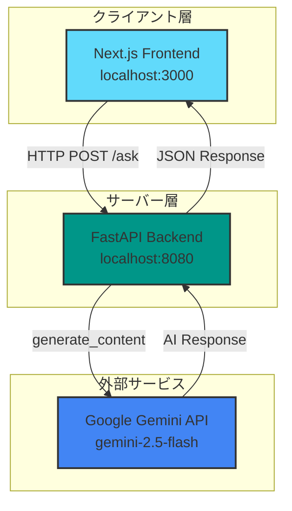
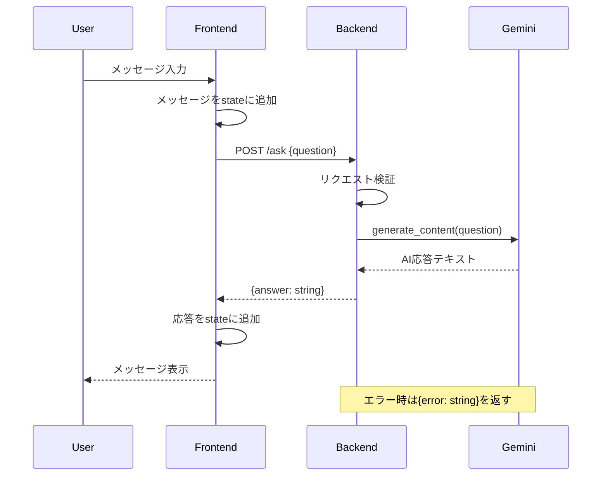
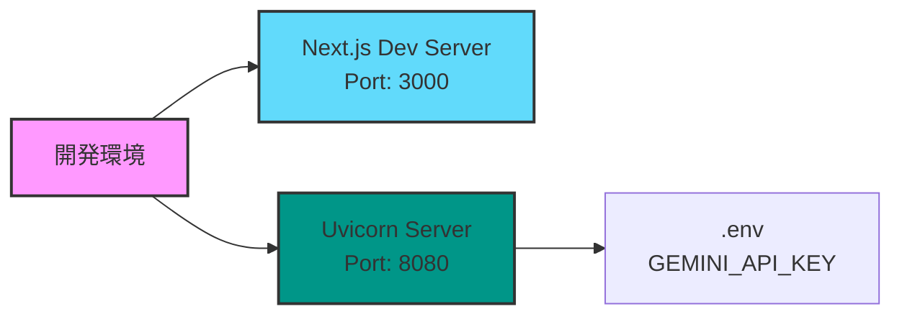
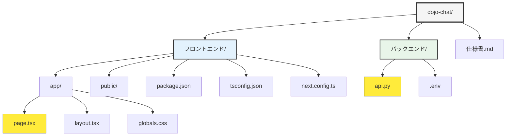
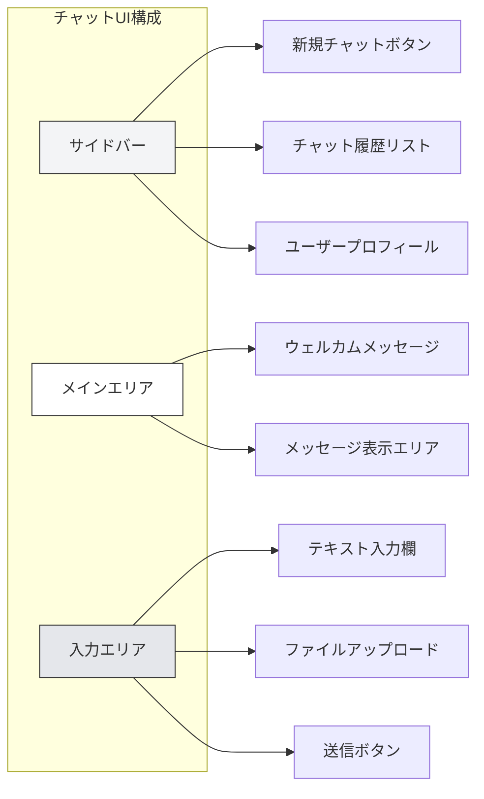
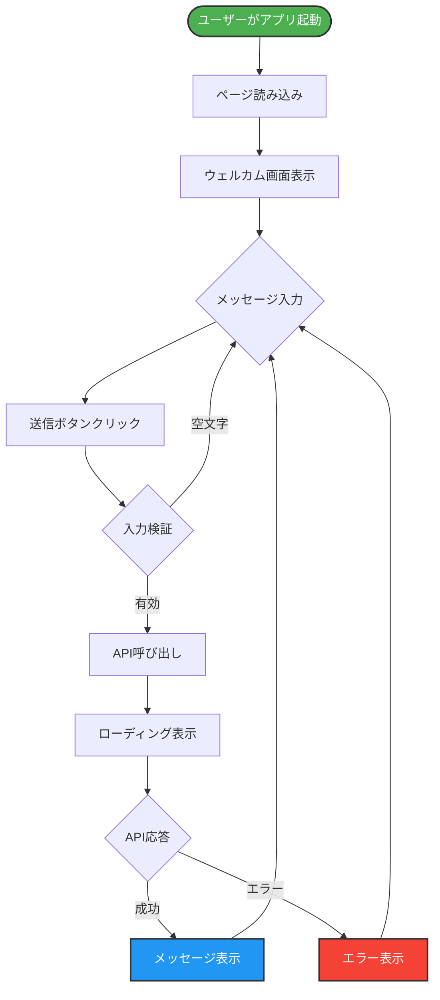
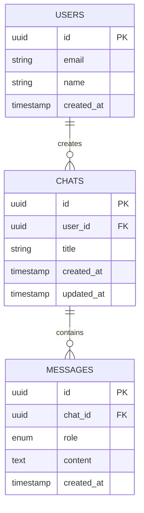
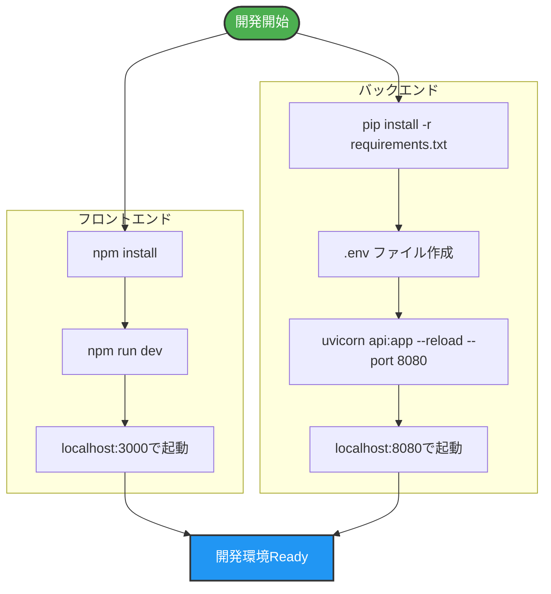
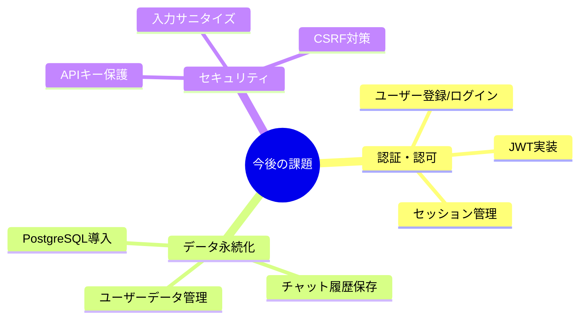
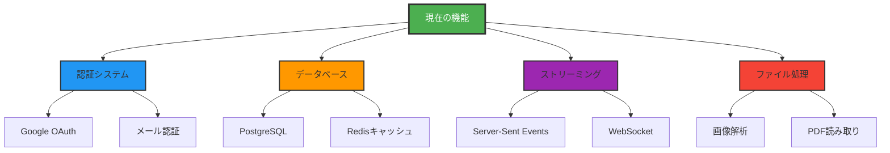

# dojo-chat プロジェクト仕様書

## 目次
1. [プロジェクト概要](#プロジェクト概要)
2. [システムアーキテクチャ](#システムアーキテクチャ)
3. [技術スタック](#技術スタック)
4. [ディレクトリ構造](#ディレクトリ構造)
5. [機能仕様](#機能仕様)
6. [API仕様](#api仕様)
7. [データモデル](#データモデル)
8. [環境設定](#環境設定)
9. [開発・デプロイ](#開発デプロイ)
10. [今後の課題と拡張](#今後の課題と拡張)

---

## プロジェクト概要

**プロジェクト名**: dojo-chat

**目的**: Google Gemini AIを活用した対話型チャットアプリケーション

**現在のステータス**: プロトタイプ段階（基本的なチャット機能実装済み）

**主要機能**:
- Google Gemini 2.5 Flash モデルとのリアルタイム対話
- モダンなチャットUI（サイドバー、メッセージ表示、入力欄）
- チャット履歴表示（現在は固定値）
- ダーク/ライトモード対応
- ファイルアップロード機能（UI実装済み）

---

## システムアーキテクチャ



### システムフロー



---

## 技術スタック

### フロントエンド

| 技術 | バージョン | 用途 |
|------|-----------|------|
| Next.js | 16.0.6 | Reactフレームワーク |
| React | 19.2.0 | UIライブラリ |
| TypeScript | 5 | 型安全な開発 |
| Tailwind CSS | 4 | スタイリング |
| ESLint | 9 | コード品質管理 |

### バックエンド

| 技術 | 用途 |
|------|------|
| FastAPI | Web APIフレームワーク |
| Uvicorn | ASGIサーバー |
| Pydantic | データ検証 |
| Google Generative AI | Gemini API SDK |
| python-dotenv | 環境変数管理 |

### インフラ・開発環境



---

## ディレクトリ構造



### 詳細構造

```
dojo-chat/
│
├── フロントエンド/
│   ├── app/
│   │   ├── page.tsx          # メインチャットUIコンポーネント (217行)
│   │   ├── layout.tsx        # ルートレイアウト定義
│   │   ├── globals.css       # グローバルスタイル
│   │   └── favicon.ico       # ファビコン
│   │
│   ├── public/               # 静的アセット
│   │   ├── file.svg
│   │   ├── globe.svg
│   │   ├── next.svg
│   │   ├── vercel.svg
│   │   └── window.svg
│   │
│   ├── package.json          # 依存関係定義
│   ├── tsconfig.json         # TypeScript設定
│   ├── next.config.ts        # Next.js設定
│   ├── postcss.config.mjs    # PostCSS/Tailwind設定
│   ├── eslint.config.mjs     # ESLint設定
│   ├── README.md             # プロジェクト説明
│   └── .gitignore
│
└── バックエンド/
    ├── api.py                # FastAPI アプリケーション (50行)
    ├── .env                  # 環境変数（GEMINI_API_KEY）
    └── .claude/              # Claude設定ディレクトリ
```

---

## 機能仕様

### 1. チャットインターフェース



### 2. 機能一覧

| 機能 | 実装状況 | 説明 |
|------|---------|------|
| メッセージ送信 | ✅ 実装済み | ユーザーメッセージをGemini APIに送信 |
| AI応答表示 | ✅ 実装済み | Geminiからの応答を表示 |
| チャット履歴表示 | 🔶 部分実装 | UIは実装済みだが固定値 |
| 新規チャット作成 | 🔶 部分実装 | ボタンは存在するが機能未実装 |
| ファイルアップロード | 🔶 部分実装 | UIのみ実装 |
| エラーハンドリング | ✅ 実装済み | try-catchでエラーを捕捉 |
| ダーク/ライトモード | ✅ 実装済み | Tailwindで対応 |
| レスポンシブデザイン | ✅ 実装済み | モバイル対応 |
| ユーザー認証 | ❌ 未実装 | 今後の課題 |
| メッセージ永続化 | ❌ 未実装 | データベース未導入 |

### 3. ユーザーフロー



---

## API仕様

### エンドポイント一覧

| メソッド | パス | 説明 | 認証 |
|---------|------|------|------|
| GET | `/` | ヘルスチェック | 不要 |
| POST | `/ask` | AI質問応答 | 不要 |

### 1. ヘルスチェック

**エンドポイント**: `GET /`

**レスポンス**:
```json
{
  "message": "hello"
}
```

**ステータスコード**: `200 OK`

### 2. AI質問応答

**エンドポイント**: `POST /ask`

**リクエスト**:
```json
{
  "question": "string"
}
```

**レスポンス（成功時）**:
```json
{
  "answer": "string"
}
```

**レスポンス（エラー時）**:
```json
{
  "error": "string"
}
```

**ステータスコード**:
- `200 OK` - 正常応答
- `422 Unprocessable Entity` - バリデーションエラー
- `500 Internal Server Error` - サーバーエラー

### APIフロー詳細

```mermaid
flowchart TD
    REQ[POST /ask]
    REQ --> VALIDATE{Pydantic検証}

    VALIDATE -->|失敗| ERR422[422 Error<br/>バリデーションエラー]
    VALIDATE -->|成功| GEMINI[Gemini API呼び出し]

    GEMINI --> TRY{例外処理}
    TRY -->|成功| SUCCESS[200 OK<br/>{answer: string}]
    TRY -->|失敗| ERR500[200 OK<br/>{error: string}]

    style REQ fill:#2196f3,stroke:#333,stroke-width:2px,color:#fff
    style SUCCESS fill:#4caf50,stroke:#333,stroke-width:2px,color:#fff
    style ERR422 fill:#ff9800,stroke:#333,stroke-width:2px,color:#fff
    style ERR500 fill:#f44336,stroke:#333,stroke-width:2px,color:#fff
```

### CORS設定

```python
allow_origins = ["http://localhost:3000"]
allow_credentials = True
allow_methods = ["*"]
allow_headers = ["*"]
```

---

## データモデル

### フロントエンド（TypeScript）

```typescript
// メッセージ型定義
interface Message {
  role: "user" | "assistant";
  content: string;
}

// チャット履歴型定義（現在は固定値）
interface Chat {
  id: string;
  title: string;
  timestamp: string;
}
```

### バックエンド（Python）

```python
from pydantic import BaseModel

class QuestionRequest(BaseModel):
    question: str
```

### データフロー

```mermaid
graph LR
    subgraph Frontend
        STATE[React State<br/>messages: Message[]]
    end

    subgraph Backend
        PYDANTIC[Pydantic Model<br/>QuestionRequest]
    end

    subgraph External
        GEMINI[Gemini API]
    end

    STATE -->|JSON| PYDANTIC
    PYDANTIC -->|question| GEMINI
    GEMINI -->|text| PYDANTIC
    PYDANTIC -->|JSON| STATE

    style STATE fill:#61dafb,stroke:#333,stroke-width:2px
    style PYDANTIC fill:#009688,stroke:#333,stroke-width:2px
    style GEMINI fill:#4285f4,stroke:#333,stroke-width:2px
```

### データベーススキーマ（予定）

現在はデータベース未実装ですが、将来的な実装案:



---

## 環境設定

### フロントエンド環境変数

現在は使用していませんが、今後必要になる可能性のある環境変数:

```env
NEXT_PUBLIC_API_URL=http://localhost:8080
```

### バックエンド環境変数

**ファイル**: `バックエンド/.env`

```env
GEMINI_API_KEY=********************************
```

### 設定ファイル

#### TypeScript設定（tsconfig.json）

```json
{
  "compilerOptions": {
    "strict": true,
    "paths": {
      "@/*": ["./*"]
    }
  }
}
```

#### Next.js設定（next.config.ts）

```typescript
import type { NextConfig } from "next";

const nextConfig: NextConfig = {};

export default nextConfig;
```

#### Tailwind CSS設定（postcss.config.mjs）

```javascript
export default {
  plugins: {
    '@tailwindcss/postcss': {},
  },
};
```

---

## 開発・デプロイ

### 開発環境セットアップ



### npm スクリプト（フロントエンド）

```json
{
  "scripts": {
    "dev": "next dev",
    "build": "next build",
    "start": "next start",
    "lint": "eslint"
  }
}
```

### 起動手順

#### 1. フロントエンド起動

```bash
cd フロントエンド
npm install
npm run dev
```

アクセス: http://localhost:3000

#### 2. バックエンド起動

```bash
cd バックエンド
pip install fastapi uvicorn google-generativeai python-dotenv
uvicorn api:app --reload --port 8080
```

アクセス: http://localhost:8080

---

## 今後の課題と拡張

### 優先度：高



### 課題一覧

| 優先度 | カテゴリ | 課題 | 説明 |
|-------|---------|------|------|
| 🔴 高 | データベース | DB導入 | PostgreSQL/MongoDB導入 |
| 🔴 高 | 認証 | ユーザー認証 | JWT/OAuth実装 |
| 🔴 高 | セキュリティ | APIキー保護 | 環境変数の適切な管理 |
| 🟡 中 | 機能 | チャット履歴 | 過去の会話の保存・読み込み |
| 🟡 中 | 機能 | ファイルアップロード | 画像・ドキュメント送信 |
| 🟡 中 | UX | ストリーミング応答 | リアルタイム応答表示 |
| 🟢 低 | テスト | テストコード | Unit/Integration tests |
| 🟢 低 | デプロイ | CI/CD | 自動デプロイパイプライン |

### 拡張機能案



### 技術的改善案

1. **パフォーマンス最適化**
   - レスポンスキャッシング
   - 画像最適化
   - コード分割

2. **エラーハンドリング強化**
   - より詳細なエラーメッセージ
   - リトライ機構
   - ログ管理システム

3. **コード品質向上**
   - TypeScript strict モード
   - ユニットテスト導入
   - コードカバレッジ測定

4. **監視・ロギング**
   - アプリケーションログ
   - エラートラッキング（Sentry等）
   - パフォーマンス監視

---

## まとめ

dojo-chatは、Google Gemini AIを活用したモダンなチャットアプリケーションのプロトタイプです。

**強み**:
- クリーンなアーキテクチャ
- モダンな技術スタック
- 拡張性の高い設計

**現状の制限**:
- データベース未実装
- 認証機能なし
- 基本的な機能のみ実装

今後、データ永続化、認証システム、高度な機能を追加することで、本格的なプロダクションレベルのチャットアプリケーションに成長させることが可能です。

---

**作成日**: 2025-12-22
**バージョン**: 1.0.0
**ステータス**: プロトタイプ段階
