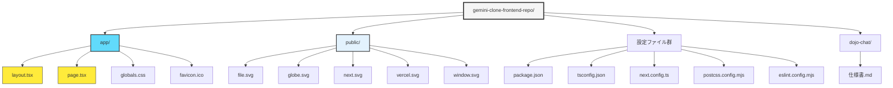
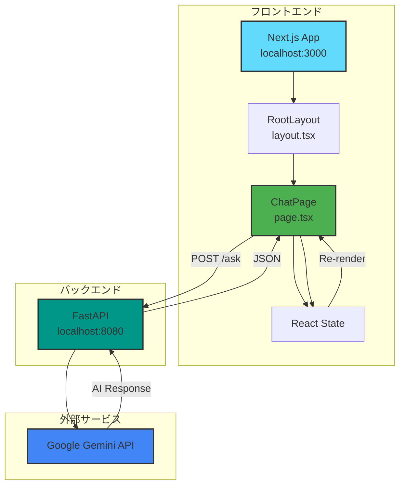
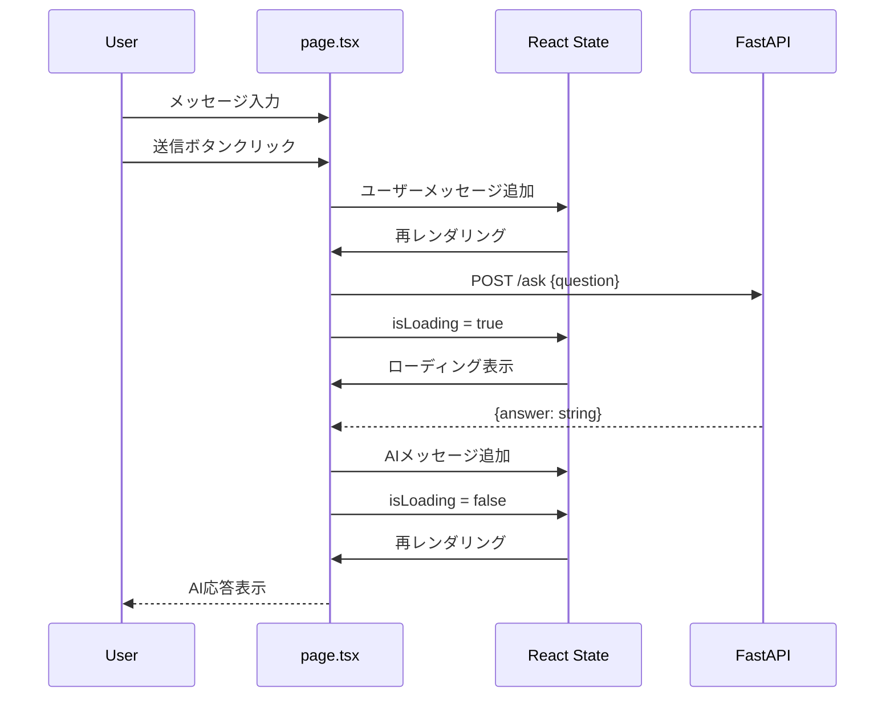
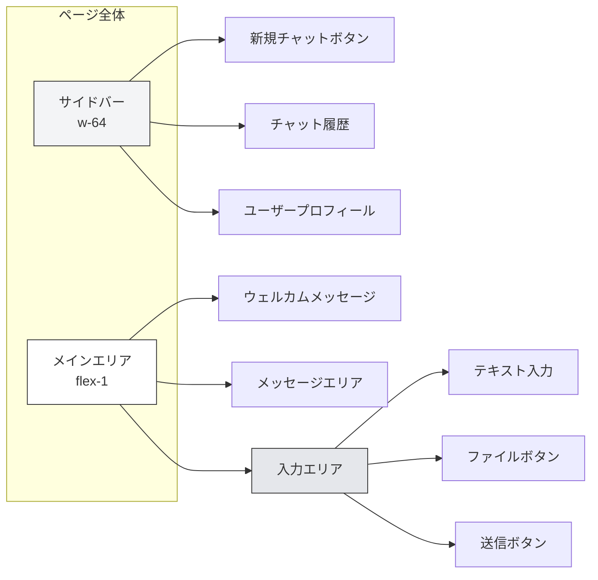
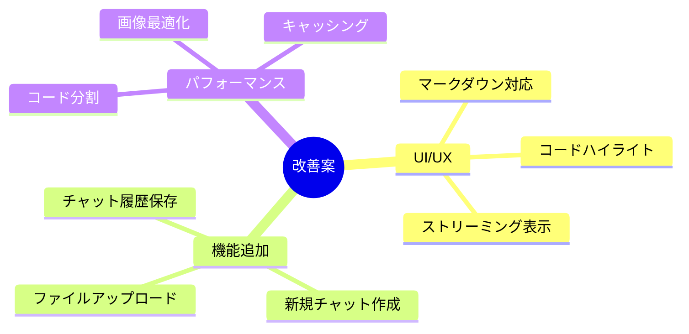

# Gemini Clone フロントエンド 仕様書

## 目次
1. [プロジェクト概要](#プロジェクト概要)
2. [技術スタック](#技術スタック)
3. [ディレクトリ構造](#ディレクトリ構造)
4. [アーキテクチャ](#アーキテクチャ)
5. [コンポーネント仕様](#コンポーネント仕様)
6. [データモデル](#データモデル)
7. [API連携](#api連携)
8. [スタイリング](#スタイリング)
9. [環境設定](#環境設定)
10. [開発・ビルド](#開発ビルド)

---

## プロジェクト概要

**プロジェクト名**: Gemini Clone Frontend

**目的**: Google Gemini AIを活用した対話型チャットアプリケーションのフロントエンド

**バージョン**: 0.1.0

**リポジトリ**: gemini-clone-frontend

**主要機能**:
- Google Gemini AIとのリアルタイムチャット
- モダンで直感的なUI/UX
- ダーク/ライトモード自動切り替え
- レスポンシブデザイン（モバイル対応）
- メッセージ履歴表示
- ファイルアップロード（UI実装済み）

---

## 技術スタック

### コアフレームワーク

| 技術 | バージョン | 用途 |
|------|-----------|------|
| Next.js | 16.0.6 | Reactフレームワーク・SSR |
| React | 19.2.0 | UIライブラリ |
| React DOM | 19.2.0 | DOM操作 |
| TypeScript | 5 | 型安全な開発 |

### スタイリング

| 技術 | バージョン | 用途 |
|------|-----------|------|
| Tailwind CSS | 4 | ユーティリティファーストCSS |
| @tailwindcss/postcss | 4 | PostCSS統合 |

### 開発ツール

| 技術 | バージョン | 用途 |
|------|-----------|------|
| ESLint | 9 | コード品質管理 |
| eslint-config-next | 16.0.6 | Next.js用ESLint設定 |
| @types/node | 20+ | Node.js型定義 |
| @types/react | 19+ | React型定義 |
| @types/react-dom | 19+ | React DOM型定義 |

### フォント

| フォント | 用途 |
|---------|------|
| Geist Sans | メインフォント |
| Geist Mono | コードフォント |

---

## ディレクトリ構造



### ファイル詳細

```
gemini-clone-frontend-repo/
│
├── app/                          # Next.js App Router
│   ├── layout.tsx                # ルートレイアウト (35行)
│   ├── page.tsx                  # メインチャットUI (217行)
│   ├── globals.css               # グローバルスタイル (27行)
│   └── favicon.ico               # ファビコン
│
├── public/                       # 静的アセット
│   ├── file.svg                  # ファイルアイコン
│   ├── globe.svg                 # グローブアイコン
│   ├── next.svg                  # Next.jsロゴ
│   ├── vercel.svg                # Vercelロゴ
│   └── window.svg                # ウィンドウアイコン
│
├── package.json                  # npm依存関係定義
├── tsconfig.json                 # TypeScript設定
├── next.config.ts                # Next.js設定
├── postcss.config.mjs            # PostCSS設定
├── eslint.config.mjs             # ESLint設定
├── README.md                     # プロジェクト説明
└── .gitignore                    # Git除外設定
```

---

## アーキテクチャ

### システム構成図



### ユーザーインタラクションフロー



---

## コンポーネント仕様

### 1. RootLayout (app/layout.tsx)

**役割**: アプリケーション全体のレイアウトとメタデータ定義

**主要機能**:
- Geistフォントの読み込み
- メタデータ設定（title, description）
- グローバルスタイルの適用
- CSS変数の設定

**実装コード**:
```typescript
export const metadata: Metadata = {
  title: "Create Next App",
  description: "Generated by create next app",
};

export default function RootLayout({
  children,
}: Readonly<{
  children: React.ReactNode;
}>) {
  return (
    <html lang="en">
      <body className={`${geistSans.variable} ${geistMono.variable} antialiased`}>
        {children}
      </body>
    </html>
  );
}
```

**使用フォント**:
- `--font-geist-sans`: メインフォント
- `--font-geist-mono`: コードフォント

---

### 2. ChatPage (app/page.tsx)

**役割**: メインチャットインターフェース（217行）

#### UIレイアウト構成



#### State管理

| State | 型 | 初期値 | 用途 |
|-------|-----|--------|------|
| `messages` | `Message[]` | `[]` | チャット��ッセージ履歴 |
| `inputValue` | `string` | `""` | 入力テキスト |
| `isLoading` | `boolean` | `false` | ローディング状態 |

#### 主要関数

**1. handleSend()**

メッセージ送信処理

```typescript
const handleSend = async () => {
  if (!inputValue.trim()) return;

  const userMessage = inputValue.trim();

  // ユーザーメッセージを追加
  setMessages(prev => [...prev, { role: "user", content: userMessage }]);
  setInputValue("");
  setIsLoading(true);

  try {
    // バックエンドにリクエスト
    const response = await fetch("http://localhost:8080/ask", {
      method: "POST",
      headers: { "Content-Type": "application/json" },
      body: JSON.stringify({ question: userMessage }),
    });

    const data = await response.json();

    // AIメッセージを追加
    setMessages(prev => [
      ...prev,
      { role: "assistant", content: data.answer || "エラーが発生しました" }
    ]);
  } catch (error) {
    // エラー処理
    setMessages(prev => [
      ...prev,
      { role: "assistant", content: "接続エラーが発生しました" }
    ]);
  } finally {
    setIsLoading(false);
  }
};
```

**2. handleKeyDown()**

Enterキーでの送信処理

```typescript
const handleKeyDown = (e: React.KeyboardEvent<HTMLTextAreaElement>) => {
  if (e.key === "Enter" && !e.shiftKey) {
    e.preventDefault();
    handleSend();
  }
};
```

#### UI要素詳細

**サイドバー**:
- 幅: `w-64` (256px)
- 背景: `bg-gray-50 dark:bg-gray-900`
- 新規チャットボタン
- チャット履歴リスト（固定5件）
  - "Next.jsについて教えて"
  - "Reactのベストプラクティス"
  - "TypeScriptの使い方"
  - "Tailwind CSSのTips"
  - "API設計について"
- ユーザープロフィール（下部固定）

**メインエリア**:
- ウェルカムメッセージ（初期表示）
  - タイトル: "Gemini Clone"
  - 説明: "AIアシスタントに質問してください"
- メッセージ表示
  - ユーザー: 右寄せ、青背景
  - アシスタント: 左寄せ、灰色背景
- ローディング表示
  - テキスト: "考え中..."
  - アニメーション: パルス効果

**入力エリア**:
- テキストエリア: 自動リサイズ
- ファイルアップロードボタン（クリップアイコン）
- 送信ボタン（紙飛行機アイコン）
- 最大幅: `max-w-4xl`

---

## データモデル

### Message インターフェース

```typescript
interface Message {
  role: "user" | "assistant";
  content: string;
}
```

**フィールド説明**:

| フィールド | 型 | 説明 |
|-----------|-----|------|
| `role` | `"user" \| "assistant"` | メッセージ送信者 |
| `content` | `string` | メッセージ本文 |

**使用例**:
```typescript
const userMessage: Message = {
  role: "user",
  content: "こんにちは"
};

const assistantMessage: Message = {
  role: "assistant",
  content: "こんにちは！何かお手伝いできることはありますか？"
};
```

---

## API連携

### バックエンドエンドポイント

**ベースURL**: `http://localhost:8080`

#### POST /ask

**説明**: Gemini AIに質問を送信

**リクエスト**:
```typescript
fetch("http://localhost:8080/ask", {
  method: "POST",
  headers: {
    "Content-Type": "application/json"
  },
  body: JSON.stringify({
    question: "質問内容"
  })
});
```

**リクエストボディ**:
```json
{
  "question": "string"
}
```

**レスポンス（成功）**:
```json
{
  "answer": "string"
}
```

**レスポンス（エラー）**:
```json
{
  "error": "string"
}
```

**エラーハンドリング**:
```typescript
try {
  const response = await fetch("http://localhost:8080/ask", {...});
  const data = await response.json();

  if (data.error) {
    // エラーメッセージを表示
    setMessages(prev => [...prev, {
      role: "assistant",
      content: "エラーが発生しました"
    }]);
  } else {
    // 正常な応答を表示
    setMessages(prev => [...prev, {
      role: "assistant",
      content: data.answer
    }]);
  }
} catch (error) {
  // ネットワークエラー
  setMessages(prev => [...prev, {
    role: "assistant",
    content: "接続エラーが発生しました"
  }]);
}
```

---

## スタイリング

### グローバルスタイル (globals.css)

```css
@import "tailwindcss";

:root {
  --background: #ffffff;
  --foreground: #171717;
}

@theme inline {
  --color-background: var(--background);
  --color-foreground: var(--foreground);
  --font-sans: var(--font-geist-sans);
  --font-mono: var(--font-geist-mono);
}

@media (prefers-color-scheme: dark) {
  :root {
    --background: #0a0a0a;
    --foreground: #ededed;
  }
}

body {
  background: var(--background);
  color: var(--foreground);
  font-family: Arial, Helvetica, sans-serif;
}
```

### カラーパレット

#### ライトモード
| 変数 | 値 | 用途 |
|------|-----|------|
| `--background` | `#ffffff` | 背景色 |
| `--foreground` | `#171717` | テキスト色 |

#### ダークモード
| 変数 | 値 | 用途 |
|------|-----|------|
| `--background` | `#0a0a0a` | 背景色 |
| `--foreground` | `#ededed` | テキスト色 |

### Tailwind CSS クラス

**よく使用されるクラス**:
- `flex`, `flex-1`, `flex-col` - Flexboxレイアウト
- `w-64`, `h-screen` - サイズ指定
- `bg-gray-50`, `dark:bg-gray-900` - 背景色
- `text-gray-700`, `dark:text-gray-300` - テキスト色
- `rounded-lg`, `rounded-full` - 角丸
- `p-4`, `px-6`, `py-2` - パディング
- `mb-4`, `mt-auto` - マージン
- `hover:bg-gray-100` - ホバー効果
- `transition-colors` - トランジション

---

## 環境設定

### TypeScript設定 (tsconfig.json)

```json
{
  "compilerOptions": {
    "target": "ES2017",
    "lib": ["dom", "dom.iterable", "esnext"],
    "allowJs": true,
    "skipLibCheck": true,
    "strict": true,
    "noEmit": true,
    "esModuleInterop": true,
    "module": "esnext",
    "moduleResolution": "bundler",
    "resolveJsonModule": true,
    "isolatedModules": true,
    "jsx": "react-jsx",
    "incremental": true,
    "plugins": [{"name": "next"}],
    "paths": {"@/*": ["./*"]}
  }
}
```

**重要な設定**:
- `strict: true` - 厳格な型チェック
- `paths: {"@/*": ["./*"]}` - パスエイリアス
- `jsx: "react-jsx"` - React JSX変換

### Next.js設定 (next.config.ts)

```typescript
import type { NextConfig } from "next";
const nextConfig: NextConfig = {};
export default nextConfig;
```

現在はデフォルト設定を使用。

### PostCSS設定 (postcss.config.mjs)

```javascript
const config = {
  plugins: {
    "@tailwindcss/postcss": {},
  },
};
export default config;
```

Tailwind CSS v4の統合。

### ESLint設定 (eslint.config.mjs)

```javascript
import { defineConfig, globalIgnores } from "eslint/config";
import nextVitals from "eslint-config-next/core-web-vitals";
import nextTs from "eslint-config-next/typescript";

const eslintConfig = defineConfig([
  ...nextVitals,
  ...nextTs,
  globalIgnores([".next/**", "out/**", "build/**", "next-env.d.ts"]),
]);
export default eslintConfig;
```

**含まれるルール**:
- Next.js Core Web Vitals
- TypeScript向けルール
- ビルドディレクトリの除外

---

## 開発・ビルド

### npm スクリプト

```json
{
  "scripts": {
    "dev": "next dev",
    "build": "next build",
    "start": "next start",
    "lint": "eslint"
  }
}
```

### 開発サーバー起動

```bash
# 依存関係のインストール
npm install

# 開発サーバー起動
npm run dev
```

**アクセス**: http://localhost:3000

### 本番ビルド

```bash
# ビルド
npm run build

# 本番サーバー起動
npm run start
```

### リント実行

```bash
npm run lint
```

---

## 実装状況

### 実装済み機能 ✅

| 機能 | 説明 |
|------|------|
| チャットUI | 完全なレイアウト実装 |
| メッセージ送受信 | fetch APIで実装 |
| ローディング表示 | isLoadingステートで管理 |
| エラーハンドリング | try-catchで実装 |
| ダーク/ライトモード | CSS変数で自動切り替え |
| レスポンシブデザイン | Tailwindで実装 |
| Enterキー送信 | キーボードイベント対応 |

### 部分実装機能 🔶

| 機能 | 現状 |
|------|------|
| チャット履歴 | 固定値5件を表示 |
| 新規チャット | ボタンのみ実装 |
| ファイルアップロード | UIのみ実装 |

### 未実装機能 ❌

| 機能 | 説明 |
|------|------|
| 認証機能 | ユーザー登録・ログイン |
| 履歴永続化 | データベース連携 |
| マルチセッション | 複数チャット管理 |
| マークダウン表示 | コードハイライト等 |
| ストリーミング応答 | リアルタイム表示 |

---

## 今後の改善案

### 優先度：高



### 技術的改善

1. **型安全性向上**
   - API レスポンスの型定義
   - Zod などでランタイム検証

2. **状態管理改善**
   - Zustand や Jotai 導入
   - グローバル状態管理

3. **テスト導入**
   - Jest + React Testing Library
   - E2Eテスト（Playwright）

4. **パフォーマンス最適化**
   - React.memo でメモ化
   - useCallback/useMemo 活用
   - 仮想スクロール導入

---

## まとめ

Gemini Clone フロントエンドは、Next.js 16とReact 19を使用したモダンなチャットアプリケーションです。

**強み**:
- 最新技術スタックの採用
- TypeScriptによる型安全性
- Tailwind CSSでのスタイリング
- シンプルで拡張性の高い設計

**今後の発展**:
- チャット履歴の永続化
- ユーザー認証の実装
- マークダウン対応
- ストリーミング表示

**技術的特徴**:
- App Router（Next.js 13+）
- React Server Components
- クライアントサイドフェッチ
- CSS変数でのテーマ管理

---

**作成日**: 2026-01-06
**バージョン**: 0.1.0
**ステータス**: プロトタイプ段階
